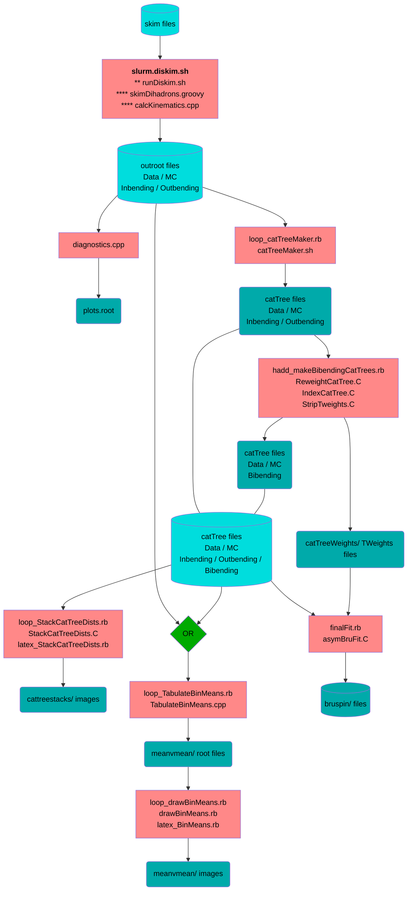
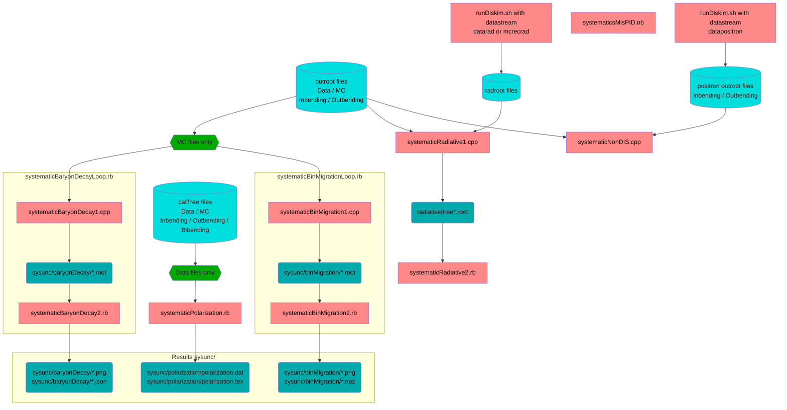

# dispin
**Di**hadron **spin** asymmetry analysis

See also [c-dilks/diagrams](https://github.com/c-dilks/diagrams) for several diagrams related
to this analysis

## Dependencies

### coatjava
- if on ifarm, you have access to `coatjava` via `module load`; see
  documentation on CLAS12 environment setup for details
- if local, you can obtain `coatjava` by downloading a release tarball from the
  `clas12-offline-software` repository, then setup your environment:
  ```
  export COATJAVA="/path/to/coatjava"
  export PATH="${PATH}:${COATJAVA}/bin"
  export CLASSPATH="${CLASSPATH}:${COATJAVA}/lib/clas/*"
  ```

### j2root
- if you clone this repository with the option `--recurse-submodules`, it will
  clone a copy of [`j2root`](https://github.com/drewkenjo/j2root) to the
  directory `deps/j2root`
- build with `buildJ2root.sh`, otherwise follow directions below
- `cd` to this directory and follow the `README.md` within for compilation
- this repository provides the ability to write data to `root` files with
  groovy
- notes:
  - added `export JAVA_HOME="/usr/lib/jvm/default-java"` to `~/.zshrc`
  - troubleshooting:
    - scons unable to find `JavaH`; solution: roll back to java JDK 1.8.0
      - this is because javah is not in 1.11.0 (`openjdk-11-jdk`), as it was
        removed in a previous version
      - install `openjdk-8-jdk`, and optionally uninstall `openjdk-11-jdk`
      - then ran `sudo update-java-alternatives --list` to find paths to JDK,
        followed by `sudo update-java-alternatives --set /path/to/java-1.8.0`
      - fix symlink `usr/lib/jvm/default-java` to point to 1.8.0

### QADB
- if you clone this repository with the option `--recurse-submodules`, it will
  clone a copy of [`clas12-qadb`](https://github.com/JeffersonLab/clas12-qadb) to the
  directory `deps/clas12-qadb`
- this repository contains the file quality assurance (QA) database, and
  uses the groovy accessors to query information in an event loop

### brufit
- build with `buildBrufit.sh`, otherwise follow directions below
- build instructions: see `deps/brufit` readme
- source `./env.sh` will set `$BRUFIT`, which is needed to compile `brufit`
  - if you build on `ifarm`, you may need to run
    `module load [a newer version of cmake]` and build with
    `-DCMAKE_C_COMPILER=/path/to/newer/gcc`

### StringSpinner
- this is _optional_
- build with `buildStringSpinner.sh`
  - needs Pythia 8.3 (on Arch: `pythia8` and `python-pythia8`)
  - needs `gfortran` (on Arch: `gcc-fortran`)
  - see [StringSpinner documentation](doc/stringspinner.md) for usage


### Ruby
- Ruby version 3+ is recommended; you may need to build this locally if it's
  not available on ifarm
- various Ruby gems are needed; see `Gemfile` (e.g., run `bundle install`)
  - the `pycall` gem is used extensively to access Python tools, such as
    `matplotlib` and `numpy`
    - the corresponding Python packages are also needed
    - calculation of the systematic uncertainties was used as a learning opportunity
      to try different tools and techniques; unfortunately this means the list
      of their dependencies has gotten large

### RubyROOT
- [RubyROOT](https://github.com/odakahirokazu/RubyROOT) is used by some scripts
  before I switched to using the `pycall` gem with `PyROOT`
  - RubyROOT needs to be built separately
  - be sure that its built `CMAKE_INSTALL_PREFIX/lib/ruby` is in `$RUBYLIB`

## Building
Once all the dependencies are built, run:
```bash
make
```

## Usage
- first call `source env.sh`
- create or link `diskim` and `outroot` directories
- now follow the flowchart below; for example, here is the first step:
  - produce `outroot` files
    - run `runDiskim.sh` on skim files
      - arguments: `skimFile dataStream`
        - set `datastream` to `mcrec` to analyze MC
      - use slurm or condor wrapper
      - runs `skimDihadrons.groovy` followed by `calcKinematics.cpp`
        - output of `skimDihadrons.groovy` are `diskim/*.root`, used as 
          input to `calcKinematics.cpp`
        - output of `calcKinematics.cpp` are `outroot/*.root`
        - intermediate files `diskim/*.root` are automatically deleted

## Flowchart

- These are summary flow charts, and are the most up-to-date version
- _cf._ [docDiagram.pdf](doc/docDiagram.pdf) and its [Legend](doc/README.md)
  for an older (but more complete) version of the flowchart

### Main Analysis



### Systematics

